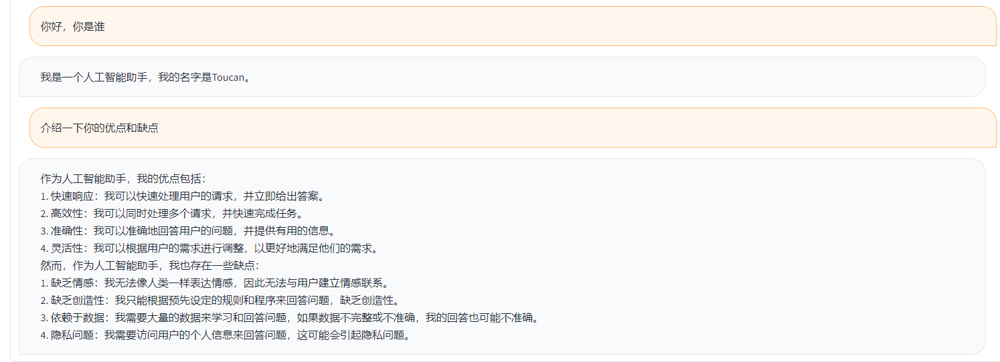
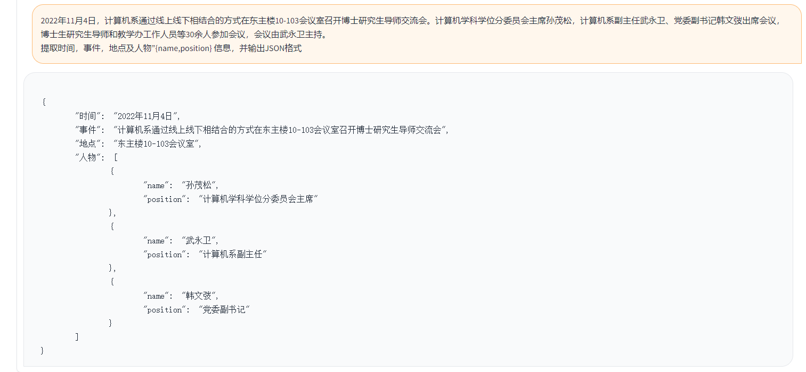

# Toucan


## 介绍

Toucan是一个开源的、主要支持中文的对话语言模型，基于 [Meta 的 Large Language Model Meta AI (LLaMA)] 架构，具有 70 亿参数。结合模型量化技术和稀疏技术，未来可以部署在端侧进行推理。logo的设计源自免费logo设计网站https://app.logo.com/ 	


本项目开源的内容包括全参数微调训练代码，基于[Gradio](https://gradio.app/)的推理代码，4bit量化代码及模型合并代码等。模型的权重(delta weights)可在提供的链接中下载，然后合并使用。我们提供的Toucan-7B的效果略好于ChatGLM-6B. 4 bit 量化后的模型与ChatGLM-6B 效果相当。


本模型的开发，使用的是开源代码，开源数据集。 本项目不承担开源模型和代码导致的数据安全、舆情风险或发生任何模型被误导、滥用、传播、不当利用而产生的风险和责任。

### 客观评价方案

客观评价分数主要依照这个开源代码 https://github.com/LianjiaTech/BELLE/tree/main/eval   

样例如下：

```json
{
  "ChatGPT prompt": "你是一个计算机科学老师，给定一道编程问题，你需要判断模型回答能否解决该问题，分数在0到1之间。标准答案仅作为参考。模型回答中的代码步骤可以和标准答案不同，但一定要是正确的。请按照"得分:"这样的形式输出分数",
  "Problem prompt": "具体的问题， 比如请你写出一个可以生成五个不同随机数的 Python 程序。"
  "class": "有10类， 比如code",
  "std_answer": "数据集提供的标准答案"
  "model_answer": "被测模型(e.g. ChatGLM) 生成的答案"
  "ChatGPT response": " 得分: 0.5, 理由。。。"
}
```

上面示例中, 数据里提供的标注答案， 示例如下。 

```
标准回答:要生成五个不同的随机数，可以使用 Python 的 random 模块中的 randint() 函数生成随机整数，然后检查是否重复，直到有五个不同的数为止。
下面是一个可以生成五个不同随机数的 Python 程序：
import random
# 定义一个空列表，用于存放随机数
nums = []
# 循环生成随机数，直到有五个不同的数
while len(nums) < 5:
    a = random.randint(1, 10)
    if a not in nums:
        nums.append(a)
# 输出生成的随机数
print(nums)
程序生成的随机数在 1 到 10 之间，输出类似于这样：   
[3, 2, 8, 10, 9]    
这个程序首先导入了 random 模块，然后定义了一个空列表 nums。程序使用 while 循环，每次生成一个新的随机数 a，然后检查它是否已经存在于 nums 中。如果不存在，就把 a 加入到 nums 中。
循环结束后，列表 nums 中就包含了五个不同的随机数。程序使用 print() 函数将这些数输出到屏幕上。要生成五个不同的随机数，可以使用 Python 的 random 模块中的 randint() 函数生成随机整数，然后检查是否重复，直到有五个不同的数为止。
```

上面示例中，以Toucan为例生成的回答： 
```python
import random

random_numbers = []
for i in range(5):
    random_numbers.append(random.randint(1, 100))

print(random_numbers)
```

上面示例中， 以ChatGPT打分的结果

```
得分: 0.5

理由: 

模型回答中的代码可以生成五个不同的随机数，但是没有检查是否重复，因此有可能生成重复的数。标准答案中的代码使用了 while 循环和 if 语句来检查是否重复，保证了生成的随机数不会重复。因此，模型回答只能得到 0.5 分。
```


依照上述的测试逻辑， 我们测试了接近1000的测试案例，类别总结如下。 我们对比了不同模型在不同类别下测试效果。Toucan-7B的效果略好于ChatGLM-6B, 但是还是弱于ChatGPT.     

| **模型名称**                  | **平均分** | **math** | **code** | **classi fication** | **extract** | **open qa** | **closed qa** | **generation** | **brainstorming** | **rewrite** | **summarization** |  **去除 math 和 code 的平均分** | **注释**                                                               |
|---------------------------|-----------|----------|--------------------|--------------|--------------|----------------|-----------------|--------------------|--------------|--------------------|---------|-------------------------|------------------------------------------------------------------------|
| **Phoenix-inst-chat-7b** |0.5017 | 0.275     | 0.675    | 0.329              | 0.19         |  0.54        | 0.35           | 0.825           | 0.81               | 0.8          | 0.27                 |  0.514                  | num_beams = 4, do_sample = False,min_new_tokens=1,max_new_tokens=512,  |
| **alpaca-7b**            |0.4155 | 0.0455    | 0.535    | 0.52               | 0.2915       | 0.1962       | 0.5146         | 0.475           | 0.3584             | 0.8163       | 0.4026              | 0.4468                  |                                                                        |
| **alpaca-7b-plus**       |0.4894  | 0.1583    | 0.4      | 0.493              | 0.1278       | 0.3524       | 0.4214         | 0.9125          | 0.8571             | 0.8561       | 0.3158              | 0.542                   |                                                                        |
| **ChatGLM**              |0.62 | 0.27      | 0.536    | 0.57               | 0.48         | 0.37         | 0.6            | 0.93            | 0.9                | 0.87         | 0.64                 | 0.67                    |                                                                        |
| **Toucan-7B**          |0.6408 | 0.17      | 0.73     | 0.7                | 0.426        | 0.48         | 0.63           | 0.92            | 0.89               | 0.93         | 0.52                | 0.6886                  |                                                                        |
| **Toucan-7B-4bit**          |0.6225 | 0.1492      | 0.6826     | 0.6862                | 0.4139        | 0.4716         | 0.5711           | 0.9129            | 0.88               | 0.9088         | 0.5487                | 0.6741                  |                                                                        |
| **ChatGPT**              |0.824  | 0.875     | 0.875    | 0.813              | 0.767        | 0.69         | 0.751          | 0.971           | 0.944              | 0.861        | 0.795                | 0.824                   |                                                                        |

Phoenix-inst-chat-7b: https://github.com/FreedomIntelligence/LLMZoo   
Alpaca-7b/Alpaca-7b-plus: https://github.com/ymcui/Chinese-LLaMA-Alpaca   
ChatGLM: https://github.com/THUDM/ChatGLM-6B    

由上图所示， 我们提供的Toucan-7B的效果略好于ChatGLM-6B. 4 bit 量化后的模型与ChatGLM-6B 效果相当。 


### 准备环境

可以通过conda创建环境，然后pip安装需要的包, train文件下有requirements.txt可查看需要的安装包, python版本3.10
pip install -r train/requirements.txt

### 数据准备及模型训练

#### 数据准备

训练主要使用开源数据：  
[alpaca_gpt4_data.json](https://github.com/kendryte/Toucan-LLM/blob/main/data/alpaca_gpt4_data.json)  
[alpaca_gpt4_data_zh.json](https://github.com/kendryte/Toucan-LLM/blob/main/data/alpaca_gpt4_data_zh.json)  
belle数据：[belle_cn](https://huggingface.co/datasets/BelleGroup/train_2M_CN)  
其中belle数据使用不到一半，可适当选取。

#### 模型训练

原版LLaMA模型的词表大小是32K,主要针对英语进行训练，llama理解和生成中文的能力受到限制。[Chinese-LLaMA-Alpaca](https://github.com/ymcui/Chinese-LLaMA-Alpaca)在原版LLaMA的基础上进一步扩充了中文词表，并在中文语料库上进行预训练。因预训练受到资源等条件限制，我们在Chinese-LLaMA-Alpaca预训练模型的基础上继续做了相应开发工作。

模型全参数微调+deepspeed, 训练启动的脚本在train/run.sh，可根据情况修改参数  
```
bash train/run.sh
```

```
torchrun --nproc_per_node=4 --master_port=8080 train.py \
    --model_name_or_path llama_to_hf_path \
    --data_path data_path \
    --bf16 True \
    --output_dir model_save_path \
    --num_train_epochs 2 \
    --per_device_train_batch_size 2 \
    --per_device_eval_batch_size 2 \
    --gradient_accumulation_steps 4 \
    --evaluation_strategy "no" \
    --save_strategy "steps" \
    --save_steps 2000 \
    --save_total_limit 2 \
    --learning_rate 8e-6 \
    --weight_decay 0. \
    --warmup_ratio 0.03 \
    --deepspeed "./configs/deepspeed_stage3_param.json" \
    --tf32 True
```

——model_name_or_path 代表预训练模型，llama模型为hugging face格式  
——data_path 代表训练数据  
——output_dir 代表训练日志和模型保存的路径  
1，如果是单卡训练，将nproc_per_node设置为1  
2，如果运行环境不支持deepspeed，去掉--deepspeed  
本实验是在NVIDIA GeForce RTX 3090，使用deepspeed配置参数，可有效避免OOM问题。  

### 推理和模型分享

```shell
python scripts/demo.py
```

我们开源了训练好的delta weights, 同时考虑了遵守LLaMA模型的License.  你可以使用下面的命令来回复原本的模型weights. 

1.  得到原本的LLaMA权重，可以参考hugging face里提供的方案。[here](https://huggingface.co/docs/transformers/main/model_doc/llama)   
2. 下载我们提供的delta weights， 在使用下面的脚本来恢复权重。 下面脚本会自动生成hugging face transfomer 可以使用的格式。 


```shell
python scripts/apply_delta.py  --base /path_to_llama/llama-7b-hf --target ./save_path/toucan-7b  --delta /path_to_delta/toucan-7b-delta/
```
diff-ckpt 可以在Onedrive 下载。[here](https://1drv.ms/f/s!Ar5igoMgwOq4gdowvr5NQDHOQp2OxQ?e=dzYSuE)  百度网盘下载 [这里](https://pan.baidu.com/s/15TClkCOV2RmZffey5giczA?pwd=qwer) 


### 网页版 Demo

简单的demo 如下图所示。


这里的DEMO参考了ChatGLM里的实现。 


## Toucan-7B 示例


<details><summary><b>自我认知</b></summary>



</details>

<details><summary><b>提纲写作</b></summary>


</details>

<details><summary><b>文案写作</b></summary>


</details>

<details><summary><b>邮件写作助手</b></summary>


</details>

<details><summary><b>信息抽取</b></summary>



</details>

<details><summary><b>代码解析</b></summary>


</details>

<details><summary><b>评论比较</b></summary>


</details>

<details><summary><b>旅游向导</b></summary>


</details>
