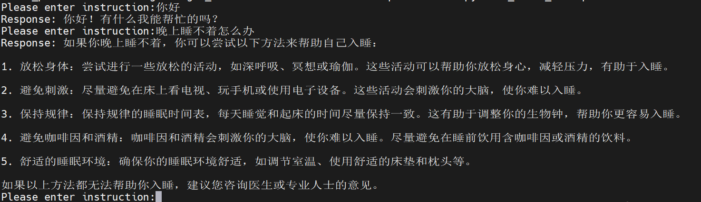

## 生成量化参数

```python
python llama7b_generate_quant.py llama_model_path  cal_dataset_json_path
```


## 推理量化模型
```python
python llama7b_eval_4bit.py llama_model_path  dataset_json_path tokenizer_dir --save_json save_json
```


## 模型自动下载，4bit模型推理
```python
python llama7b_inference_4bit.py llama_model_save_path 
```
效果如下：   



